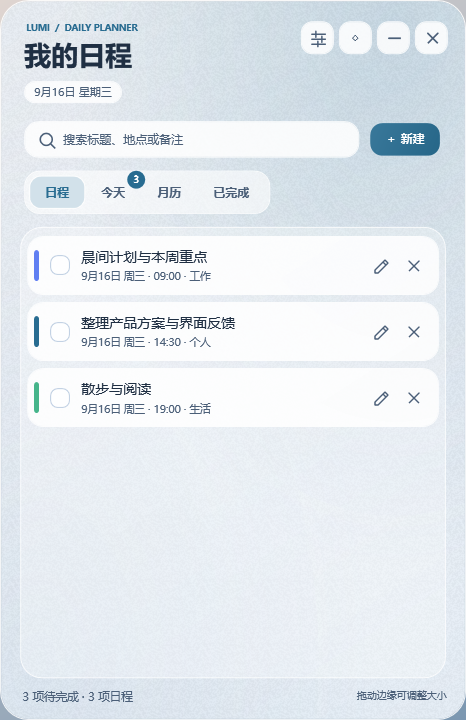
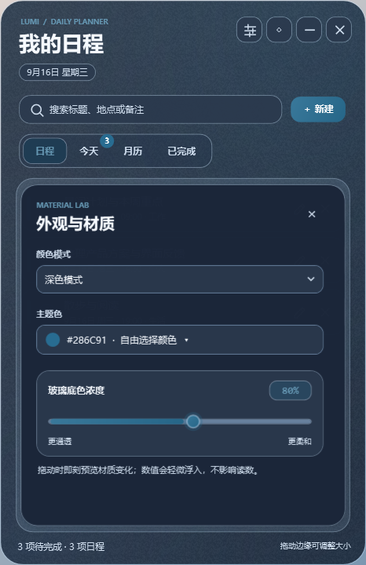
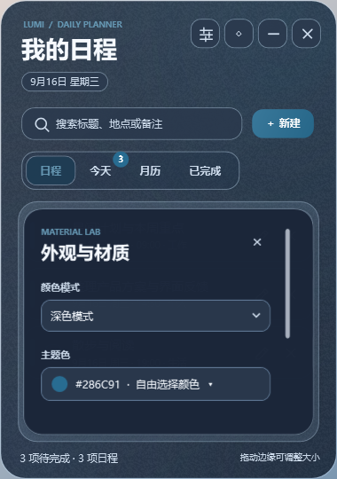

# 流光日程 · 玻璃拟态版

这是 [桌面待办清单](https://github.com/huhuhuzx/desktop-todo-widget) 旁边的独立外观版本，保留待办、日程、月历与提醒功能。界面按玻璃拟态风格重做：柔光、半透明分层、细边框、轻颗粒与清晰的文字层级；浅色、深色和自选主题色均可用。

## 下载

前往 [Releases](https://github.com/huhuhuzx/desktop-todo-widget-glass/releases) 下载最新版本，双击即可运行。

## 功能

- 日程、今天、月历、已完成四种视图
- 自定义标题、日期、时间、分类、重复、提醒、地点与备注
- 玻璃拟态界面：半透明分层、柔光、细边框与轻颗粒
- 浅色 / 深色模式，主题色可自由选择
- 玻璃底色浓度可调
- 任务提醒与漏提醒补报
- 窗口可拖动、缩放，并支持始终置顶
- 数据保存在本地，不上传任何服务器

## 快速开始

1. 下载并运行程序
2. 点击右上角「新建」添加日程
3. 在设置中调整主题色、外观与玻璃浓度
4. 勾选任务即可完成；重复日程会自动生成下一次

任务数据保存在程序目录下的 `tasks.json`，本机设置保存在 `widget-settings.json`。本版本与原版使用不同文件夹，可并排运行。

## 从源码编译

在 Windows PowerShell 中运行：

```powershell
powershell -ExecutionPolicy Bypass -File .\Build-Exe.ps1
```

编译需要系统自带的 .NET Framework WPF 工具链，会生成 `流光日程.exe`。

运行 `流光日程.exe --preview` 可在 `preview` 文件夹重新生成界面预览图。预览使用内存中的演示日程，不读取或改写真实 `tasks.json`。

## 预览

| 浅色首页 | 深色设置 | 紧凑窗口 |
| --- | --- | --- |
|  |  |  |

## 设计说明

设计取舍与材质限制见 [DESIGN.md](DESIGN.md)。窗口采用单一 WPF 透明圆角与半透明渐变，不调用 DWM Acrylic，也不实时模糊窗口后方的其他应用。

## 隐私

本项目完全在本地运行，不会联网上传数据。仓库仅包含源码与编译脚本，个人任务数据与本机设置不会纳入版本控制。
